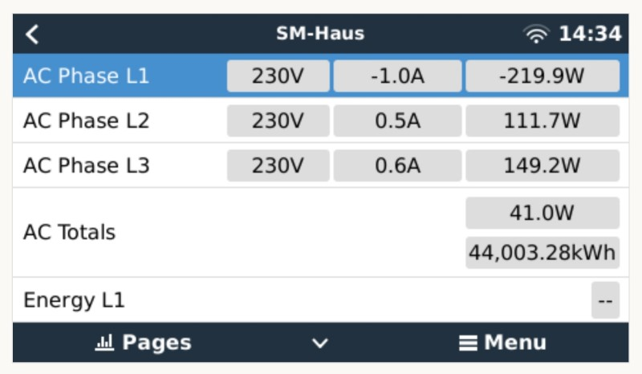

# dbus-tasmota-easymeter-q3d Service

## Purpose

This service is meant to be run on a Raspberry Pi with VenusOS from Victron.
It probably also run on a Victron CCGX device, but isn't tested till now.

The Python script reads data from a 'Hichi' (Volkszähler) device via REST API and publishes the data on the dbus.<br>
The 'Hichi' device is running Tasmota with an IR reader and is capable to read infra-red 'D0' signalling of a smartmeter.<br>
This Python script is adapted to interpret the values of an EasyMeter Q3Dxxxxx device like this:


The received data will be published, as com.victronenergy.grid service. This makes the VenusOS work as if you had a physical Victron Grid Meter installed:

<div style="display:flex">
     <div style="flex:1;padding-right:10px;">
          
     </div>
     <div style="flex:1;padding-left:10px;">
          
     </div>
</div>

<div style="display:flex">
     <div style="flex:1;padding-right:10px;">
          
     </div>
     <div style="flex:1;padding-left:10px;">
          
     </div>
</div>


## Configuration

The generic configuration is done by a questionnaire of the install script,
but if you like to change something afterwards, modify `nano /data/dbus-tasmota-easymeter-q3d/config.ini` and restart the service via `/data/dbus-tasmota-easymeter-q3d/restart.sh`

## Installation

SSH into your Venus device and install this service via:
```
SCRIPT='/tmp/easymeter-installer.sh'; wget -O $SCRIPT https://raw.githubusercontent.com/Apehaenger/venus.dbus-tasmota-easymeter-q3d/latest/install.sh && bash $SCRIPT
```
Once finished the installation, you should see your EasyMeter in your VenusOS device remote console.

## Update

Simply run:

`
/data/dbus-tasmota-easymeter-q3d/update.sh
`

## Debugging

First, you might check the logfile for failures:

`less /data/dbus-tasmota-easymeter-q3d/current.log`

If you wanna do some more detailed debugging, stop background processing of the service by:

`/data/dbus-tasmota-easymeter-q3d/uninstall.sh`

Change in config.ini the 'logging' to 'DEBUG':

`nano /data/dbus-tasmota-easymeter-q3d/config.ini`

Start processing in foreground:

`python /data/dbus-tasmota-easymeter-q3d/dbus-tasmota-easymeter-q3d.py`

Once done with debugging, don't forget to switch logging back to 'INFO', otherwise you risk a large logfile `/data/dbus-tasmota-easymeter-q3d/current.log` and activate background processing again via:

`/data/dbus-tasmota-easymeter-q3d/install.sh`

## Restart the script

If you want to restart the script, for example after changing config.ini, just run the following command:

`/data/dbus-tasmota-easymeter-q3d/restart.sh`

The 'supervisor' daemon will restart the script within a second.

## Todo

- [x] Fix hung if tasmota device get unreachable (handle connection issues)
- [x] Add 'None' values to ensure that grid doesn't get powered by battery or battery get charged from grid
- [x] Improve text/number formatting 
- [x] Config instead of static source code changes
- [x] More comfortable installer

## Thank you

Many thanks for sharing their knowledge:

* [venus.dbus-tasmota-smartmeter](https://github.com/AchimKre/venus.dbus-tasmota-smartmeter)
* [venus-os_dbus-mqtt-grid](https://github.com/mr-manuel/venus-os_dbus-mqtt-grid/blob/master/dbus-mqtt-grid)
* [dbus-shelly-1pm-pvinverter](https://github.com/vikt0rm/dbus-shelly-1pm-pvinverter)
* [dbus-shelly-3em-smartmeter](https://github.com/fabian-lauer/dbus-shelly-3em-smartmeter)